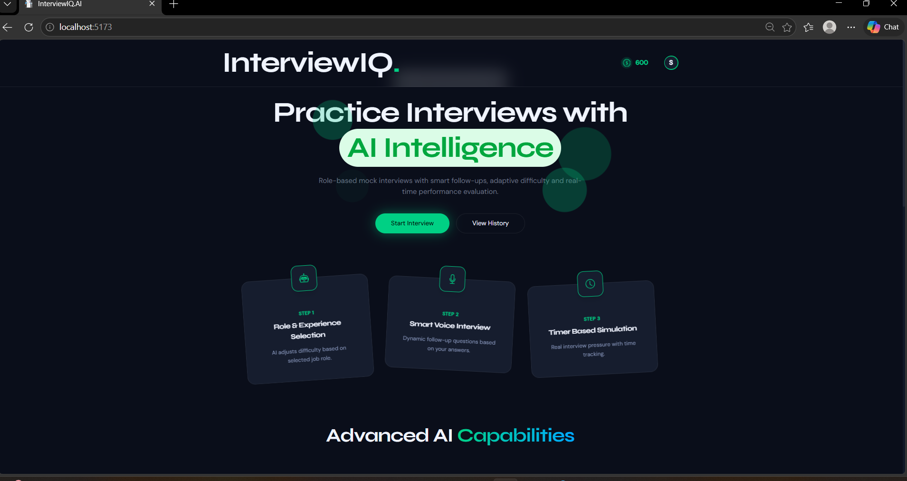
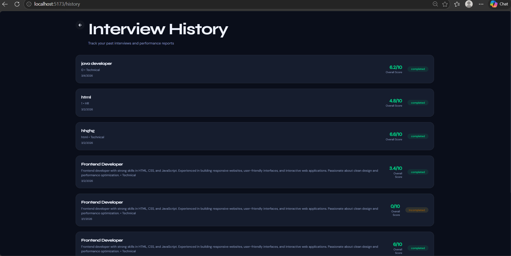
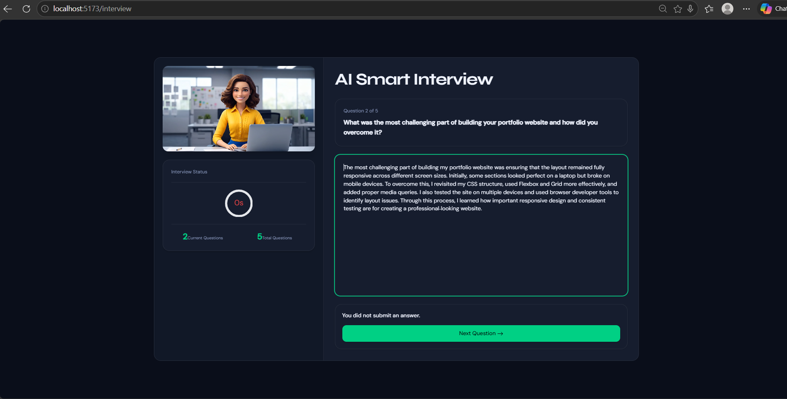
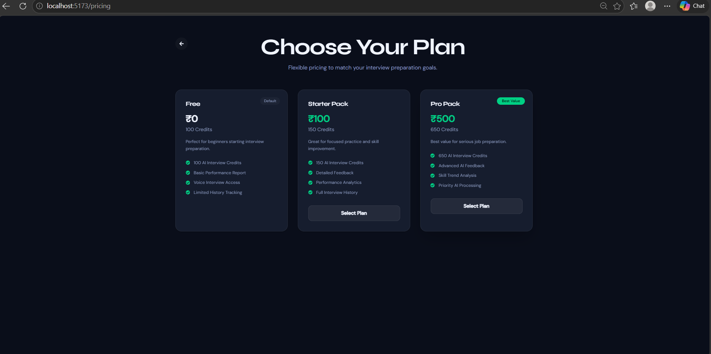

# 🎯 InterviewIQ – AI Powered Mock Interview Platform

InterviewIQ is an AI-powered mock interview platform that helps users prepare for technical and HR interviews through personalized AI-generated questions, resume analysis, and intelligent feedback. It provides a realistic interview experience to improve confidence and communication skills.

---

## 🚀 Features

- 🤖 AI-generated interview questions
- 📄 Resume upload and analysis
- 🎤 Real-time mock interview experience
- 📊 AI-based performance evaluation
- 💬 Personalized feedback and suggestions
- 🔐 Secure user authentication
- 📜 Interview history and progress tracking
- 📱 Responsive design for desktop and mobile

---

## 🛠️ Tech Stack

### Frontend
- React.js
- HTML5
- CSS3
- JavaScript
- Tailwind CSS

### Backend
- Node.js
- Express.js

### Database
- MongoDB

### Authentication
- Firebase Authentication

### AI Integration
- OpenAI API

### Payment Gateway
- Stripe (Test Mode)

### Deployment
- Render

---

## 📂 Project Structure

InterviewIQ
│
├── client/
│   ├── src/
│   ├── public/
│   └── package.json
│
├── server/
│   ├── routes/
│   ├── controllers/
│   ├── models/
│   ├── middleware/
│   └── package.json
│
├── .env
├── README.md
└── package.json

---

## ⚙️ Installation

### Clone the repository

bash
git clone https://github.com/sujeet-dev-777/interviewIQ.git

### Navigate to the project

bash
cd interviewIQ

### Install dependencies

bash
npm install

### Start the development server

bash
npm run dev

---

## Environment Variables

Create a .env file and add:

env
MONGODB_URI=your_mongodb_connection_string

OPENAI_API_KEY=your_openai_api_key

FIREBASE_API_KEY=your_firebase_key

STRIPE_SECRET_KEY=your_stripe_secret_key

---

## 📸 Screenshots

### Home Page

### History of Interview

### Interview Page 1

### Interview Page 2

### Interview Page 3

### Ongoing Interview

### Interview Report

### Payment Page

---

## Future Enhancements

- Voice-based AI interviews
- Video interview support
- Multi-language interviews
- AI Resume Builder
- Company-specific interview preparation
- Leaderboard and achievements

---

## Learning Outcomes

This project helped in understanding:

- Full Stack MERN Development
- REST APIs
- Authentication
- Database Design
- AI API Integration
- Payment Integration
- Responsive UI Design
- Git & GitHub

---

## Author

*Sujeet Sahani*

GitHub: https://github.com/sujeet-dev-777

LinkedIn: https://www.linkedin.com/in/sujeet-sahani-9a201a382?utm_source=share_via&utm_content=profile&utm_medium=member_android
---

## License

This project is open no licensed .

---

⭐ If you found this project helpful, don't forget to give it a Star on GitHub.